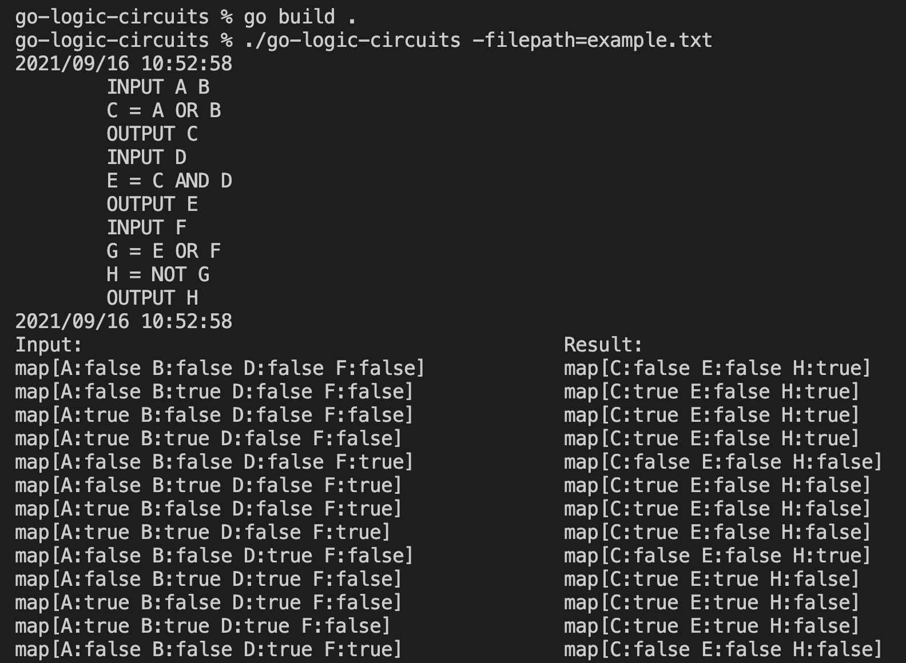

# go-logic-circuits

A Go program to run combinational logic circuits of arbitrary complexity and size. The logic circuits are implemented as graphs with `Node` structures and `channels` linking the `Nodes`. The circuits are evaluated using Go's lightweight gorountines and primitive channel type.

